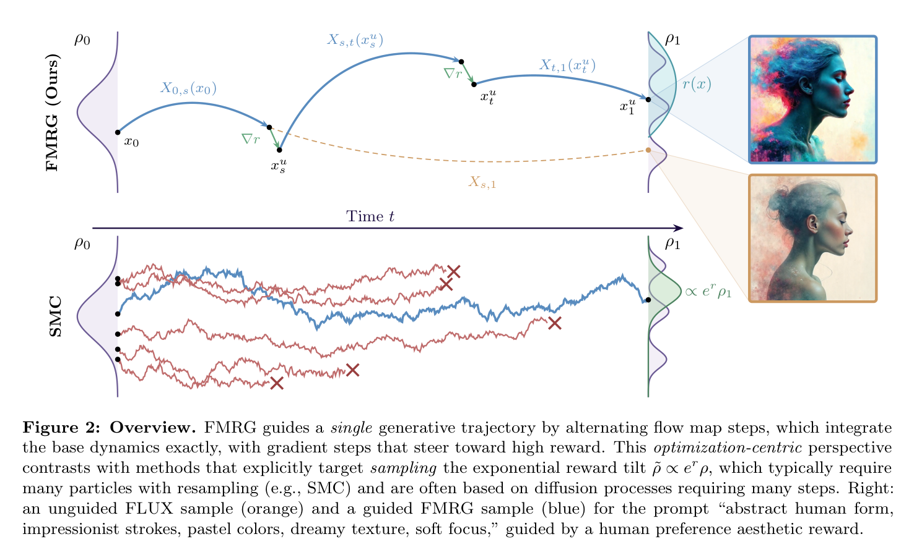

# FMRG — Flow Map Reward Guidance

[](https://icml.cc/)
[](https://arxiv.org/abs/2604.27147)
[](https://www.python.org/downloads/)

In generative modeling, we often wish to produce samples that maximize a
user-specified reward such as aesthetic quality or alignment with human
preferences, a problem known as guidance. Despite their widespread use, existing
guidance methods either require expensive multi-particle, many-step schemes or
rely on poorly understood approximations. We reformulate guidance as a
deterministic optimal control problem, yielding a hierarchy of algorithms that
subsumes existing approaches at the coarsest level. We show that the flow map,
an object of significant recent interest for its role in fast inference, arises
naturally in the optimal solution. Based on this observation, we propose Flow
Map Reward Guidance (FMRG): a training-free, single-trajectory framework that
uses the flow map to both integrate and guide the flow. At text-to-image scale,
FMRG matches or surpasses baselines across inverse problems, style transfer,
human preferences, and VLM rewards with as few as 3 NFEs, giving at least an
order-of-magnitude speedup in comparison to prior state of the art.



## Installation

```bash
git clone https://github.com/jrrhuang/fmrg.git
cd fmrg
bash install.sh
conda activate fmrg_env
bash checkpoints_download.sh
```

`install.sh` creates a conda env named `fmrg_env` from `environment.yml`.
`checkpoints_download.sh` fetches two FLUX FlowMap LoRAs into `checkpoints/`:

- `flux-flowmap-lora/` (256-res) — used by inverse problems.
- `flux-flowmap-lora-512/` (512-res) — used by reward-guided generation.

## Quick start

Shell wrappers that run each pipeline with default settings are provided in `examples/`.

### Inverse problems

FMRG-E at 6 NFEs (low-NFE regime, 1 NFE per step via `flow_map1`):

```bash
python scripts/solve_inverse_problem.py \
    --task_config configs/inverse_problems/sr_config.yaml \
    --image_path data/inverse_examples/corgi.png \
    --method fmrg --grad_mode euc \
    --num_steps 6 --num_optim_iters 5 --step_size 20 \
    --sample_mode flow_map1 --loss_mode latent \
    --prompt "a photo of a dog" --seed 0 \
    --save_dir ./results/sr --resolution 256
```

FMRG-E at 30 NFEs (higher-NFE regime, 2 NFE per step via `flow_map2`):

```bash
python scripts/solve_inverse_problem.py \
    --task_config configs/inverse_problems/sr_config.yaml \
    --image_path data/inverse_examples/corgi.png \
    --method fmrg --grad_mode euc \
    --num_steps 15 --num_optim_iters 5 --step_size 10 \
    --sample_mode flow_map2 --loss_mode latent \
    --prompt "a photo of a dog" --seed 0 \
    --save_dir ./results/sr --resolution 256
```

Available task configs:

| Config | Task |
|---|---|
| `configs/inverse_problems/sr_config.yaml` | 4× super-resolution |
| `configs/inverse_problems/motion_deblur_config.yaml` | 61×61 motion deblur |
| `configs/inverse_problems/box_inpainting_64_config.yaml` | centered 64×64 box inpainting |

`--image_path` also accepts a directory; reconstructions, measurements, and
ground-truth copies are written to `<save_dir>/<operator>/{recon,input,label}/`.
Pass `--compute_metrics` to record per-image PSNR / SSIM / LPIPS; then
`scripts/aggregate_metrics.py` aggregates them and adds FID / KID:

```bash
python scripts/aggregate_metrics.py \
    --save_dir ./results/sr \
    --gt_path ./results/sr/sr_avgpool/label
```

### Reward-guided generation

Aesthetic generation with FMRG-J (NFE 5; for NFE 9 / 13 swap to `--num_steps 32 --early_stop 8` / `--num_steps 48 --early_stop 12`):

```bash
python scripts/generate_aesthetic.py --mode guided \
    --prompts_file data/artistic_prompts.txt \
    --output_dir ./results/aesthetic --resolution 512 --seed 0 --num_seeds 1 \
    --start_idx 0 --end_idx 1 \
    --num_steps 16 --early_stop 4 --warmup_steps 0 --warmup_particles 1 \
    --step_size 3.0 --unguided_steps 2 --sample_mode flow_map1
```

Compositional generation on GenEval:

```bash
python scripts/generate_geneval.py \
    --grad_mode jac --normalize_grad --sample_mode flow_map2 \
    --num_steps 10 --step_size 3.0 --num_optim_iters 1 \
    --early_stop 5 --warmup_steps 4 --warmup_particles 3 \
    --grad_checkpointing \
    --prompts_file data/geneval_prompts/evaluation_metadata.jsonl \
    --output_dir ./results/geneval --start_idx 0 --end_idx 1 --num_samples 1
```

512-res reward guidance uses `--grad_checkpointing` to fit within ~48 GB VRAM (e.g. L40S). The aesthetic prompt set is in `data/artistic_prompts.txt`.

## Recommendations

FMRG-E (`--grad_mode euc`) tends to work well for measurement-based inverse problems, where the reward landscape lies close to the data manifold; FMRG-J (`--grad_mode jac`) tends to work well for neural-network rewards such as human-preference models. `--sample_mode flow_map1` (1 NFE per step) suits low-NFE budgets; `--sample_mode flow_map2` (2 NFE per step) suits higher-NFE regimes.

## Key flags

- `--method {fmrg, flowdps, flowchef}` — guidance algorithm (inverse problems).
- `--grad_mode {jac, euc}` — FMRG-J (Jacobian-coupled) vs FMRG-E (Euclidean).
- `--normalize_grad` — rescale each gradient to the velocity norm.
- `--num_optim_iters` — inner-loop gradient steps per guided step.
- `--sample_mode {flow_map1, flow_map2, flow_matching}` — 1-NFE flow-map step, 2-NFE flow-map step, or 1-NFE Euler step (baselines).
- `--loss_mode {pixel, latent}` — measurement-loss space.
- `--resolution {256, 512}` — auto-selects the matching LoRA.
- `--early_stop` — last guided step before the trailing unguided tail.
- `--warmup_steps` / `--warmup_particles` — reinitialization steps and particles per step.
- `--unguided_steps` — trailing uncontrolled flow-map steps to t=0.

## Project structure

```
fmrg/
├── scripts/                          # entry points
│   ├── solve_inverse_problem.py      # FMRG + baselines on inverse problems
│   ├── generate_aesthetic.py         # FMRG-J + reward ensemble on aesthetic prompts
│   ├── generate_geneval.py           # FMRG + reward ensemble on GenEval prompts
│   ├── best_of_n.py                  # unguided + reward-ensemble rerank baseline
│   └── aggregate_metrics.py          # PSNR / SSIM / LPIPS / FID / KID aggregator
├── examples/                         # one-command shell wrappers
├── configs/inverse_problems/         # task YAMLs (SR, motion deblur, inpainting)
├── data/                             # prompts and sample inputs
├── fluxfm_sampler_ip.py              # FluxFlowMapSampler + FluxFlowDPS + FluxFlowChef
├── fluxfm_sampler_reward.py          # FluxFlowMapSampler + reward ensemble
├── functions/                        # measurement operators
├── utils/                            # image / inpaint / SVD / motion-blur helpers
├── flux_two_timestep/                # FLUX two-timestep pipeline + diffusers shim
├── checkpoints/                      # populated by checkpoints_download.sh
├── environment.yml
├── install.sh
└── checkpoints_download.sh
```

## Citation

```bibtex
@article{huang2026howtoguide,
  title={How to Guide Your Flow: Few-Step Alignment via Flow Map Reward Guidance},
  author={Huang, Jerry Y. and Lin, Justin and Shah, Sheel and Nair, Kartik and Boffi, Nicholas M.},
  journal={arXiv preprint arXiv:2604.27147},
  year={2026}
}
```

## Acknowledgments

This repository builds on the codebase of [FlowDPS](https://github.com/FlowDPS-Inverse/FlowDPS).
